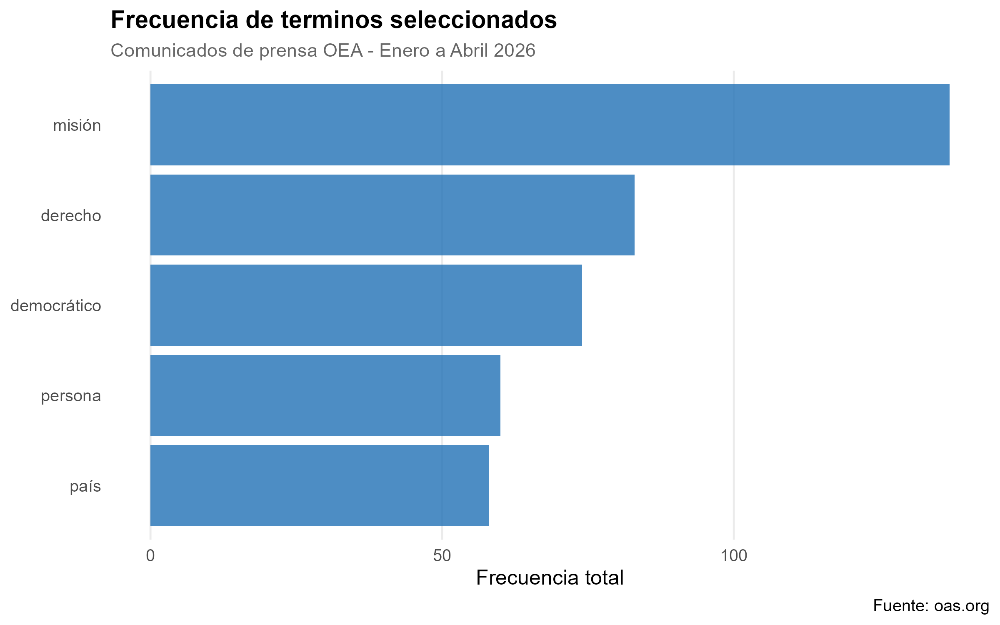

```{r}
library(here)
# Ejecutar cada etapa en orden
source(here("TP2/scripts/scraping_oea.R"))
source(here("TP2/scripts/processing.R"))
source(here("TP2/scripts/metrics_figures.R"))
```

## Introducción y estructura del proyecto

El objetivo de este trabajo analizar los comunicados de prensa publicados por la Organización de los Estados Americanos (OEA) durante los meses de enero a abril de 2026. Para esto se utilizan técnicas de web scraping y procesamiento de lenguaje natural para la creación de una base de datos que permite estudiar los patrones discursivos de estos documentos.

## Pregunta de investigación

La pregunta que guió mi analisis es la siguiente:

***¿Cuáles son los principales temas y ejes discursivos presentes en los comunicados de la OEA durante el primer cuatrimestre de 2026?***

Esta pregunta busca identificar las difrenets regularidades en el lenguaje utilizado por la organización, asumiendo desde mi análisis que la frecuencia de ciertas palabras puede reflejar las prioridades de las políticas, áreas de intervención o preocupaciones institucionales de la agenda del sistema internacional.

## Estrategia de análisis

A partir de un cuerpo de comunicado procesado, se calcularon frecuencias de aparición de palabras y se construyeron gráficos para identificar los términos más relevantes.

## Resultados del análisis

El gráfico que se presenta a continuación muestra las palabras más comunes en los comunicados analizados. En mi análisis me enfoqué en la frecuencia de los terminos: *misión, derecho, democrático, persona* y *país*



Al analizar este gráfico, podemos notar que hay muchas palabras relacionadas con la cooperación regional, la democracia y la institucionalidad. La busqueda de estas palabras sugieren que el discurso de la OEA se centra en su rol de promoción institucional y acompañamiento político en los países miembros

- **“Misión”**: alta frecuencia, asociada a actividades operativas como observación electoral y presencia de la organización en el terreno.

- **“Derecho” y “democrático”**: reflejan la orientación normativa, reforzando valores y principios institucionales.

- **“Persona”**: indica un enfoque en los individuos, vinculado a derechos humanos y dimensión social.

- **“País”**: muestra que los comunicados se estructuran en torno a contextos nacionales específicos.

En conjunto, los resultados sugieren que el discurso de la OEA durante el primer cuatrimestre de 2026 está fuertemente orientado a la promoción de la democracia, el fortalecimiento institucional y la cooperación entre Estados.

Estas palabras elegidas proyectan un discurso que combina accion práctica, legitimación normativa, enfoque ciudadano y refrencia a contextos nacionales, reforzando la identidad de la OEA como organismo regional con un rol politico y social activo.
